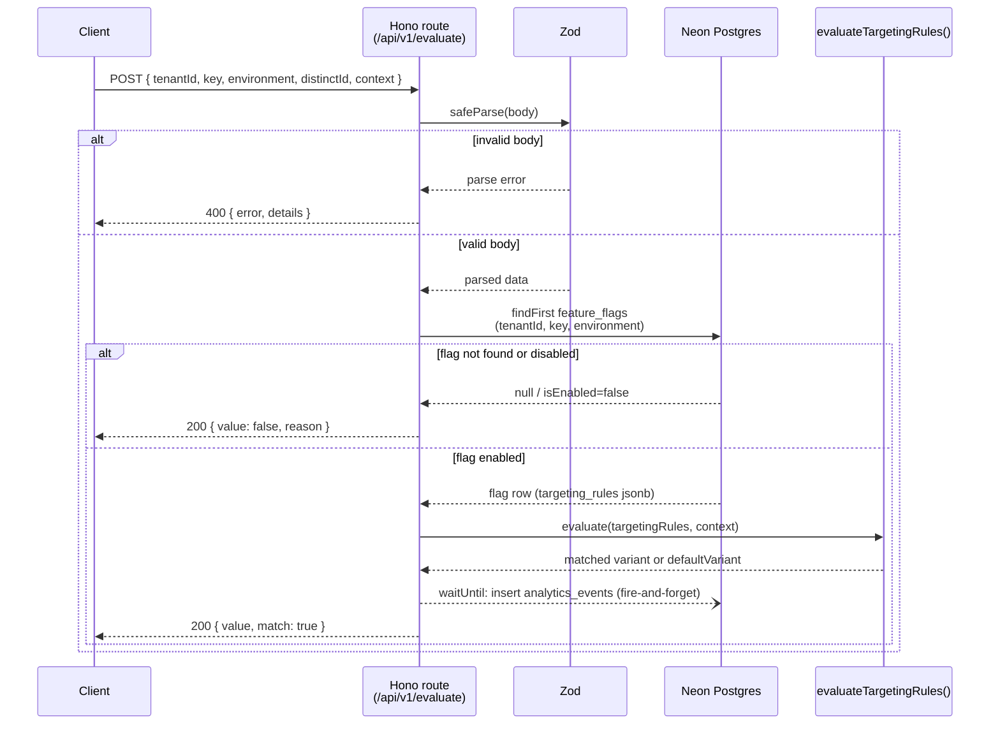

# pulse-forge

**pulse-forge** is a multi-tenant feature-flag evaluation API and event-analytics ingestion service. It's built as a Hono API colocated inside a Next.js App Router project and backed by Neon Postgres. It targets edge-native deployment (e.g. Vercel Edge Runtime) with a fully typed client/server contract via Hono RPC.

## Table of Contents

- [Features](#features)
- [Architecture & Design Decisions](#architecture--design-decisions)
- [Tech Stack](#tech-stack)
- [API Reference](#api-reference)
  - [`GET /api/health`](#get-apihealth)
  - [`POST /api/v1/evaluate`](#post-apiv1evaluate)
- [Request Flow](#request-flow)
- [Repository Structure](#repository-structure)
- [Environment Variables](#environment-variables)
- [Local Development Guide](#local-development-guide)
  - [Getting Started](#getting-started)
  - [Available Scripts](#available-scripts)
  - [Database Management (Drizzle Kit)](#database-management-drizzle-kit)
- [Git Workflow & CI/CD](#git-workflow--cicd)
- [License](#license)

## Features

- **Multi-tenant schema:** `tenants`, `users`, `feature_flags`, `analytics_events` tables (Drizzle + Postgres) with `ON DELETE CASCADE` from tenant, and a unique `(tenant_id, key, environment)` index so the same flag key can exist per environment per tenant.
- **Flag evaluation endpoint:** `POST /api/v1/evaluate` resolves a flag by tenant/key/environment and evaluates its `targeting_rules` JSONB in-memory (no extra DB round-trip), supporting both boolean and multivariate flags with a `defaultVariant` fallback.
- **Async analytics ingestion:** every evaluation call writes an `analytics_events` row off the request's critical path via `executionCtx.waitUntil` (with a non-edge fallback so it doesn't unhandled-reject in local/test runs).
- **Typed Hono RPC contract:** the API's `AppType` is exported and consumed directly by `createRpcClient`, so frontend/backend drift is caught at compile time rather than at runtime.
- **Read-only tenant dashboard:** `/dashboard/[tenantSlug]` server-renders the list of `production`-environment flags for a tenant resolved by slug.
- **Seed script:** `src/db/seed.ts` provisions one tenant, one user, a boolean flag, and a multivariate flag for local testing.

## Architecture & Design Decisions

- **Colocated monolith:** the Hono API lives inside the Next.js App Router catch-all route (`src/app/api/[[...route]]/route.ts`), so frontend and API ship from one project with no cross-repo version drift.
- **End-to-end type safety (Hono RPC):** `src/lib/rpc.ts` instantiates `hc<AppType>()` against the route module's exported type, giving compile-time errors the moment the API schema and a caller diverge.
- **Edge-optimized data modeling:** flag targeting rules (conditions, rollout rules, variants) live as a single `jsonb` column on `feature_flags` rather than normalized tables, so evaluation is one indexed row lookup plus in-memory rule matching (`src/lib/evaluator.ts`).
- **Dual database driver, chosen at runtime:** `src/db/index.ts` inspects `DATABASE_URL` — `localhost`/`127.0.0.1` routes through `pg` for local Postgres, anything else through `@neondatabase/serverless`.

## Tech Stack

| Layer              | Technology                                  | Notes                                                                                                                                  |
| :----------------- | :------------------------------------------ | :------------------------------------------------------------------------------------------------------------------------------------- |
| **Frontend**       | Next.js 15.5.20 (App Router) + React 19.0.0 | Server Components render the dashboard; no client-side flag-management UI yet.                                                         |
| **Backend**        | Hono ^4.6.0                                 | Mounted at `/api` inside the Next.js edge route handler; Zod (^3.24.0) validates all input.                                            |
| **Database & ORM** | PostgreSQL (Neon) + Drizzle ^0.45.2         | `@neondatabase/serverless` in production/non-local; `pg` for local Postgres.                                                           |
| **Testing**        | Vitest ^3.0.0, Playwright ^1.49.0           | Vitest hits a real Neon test branch (see [Environment Variables](#environment-variables)), not a mock DB. Playwright has no specs yet. |
| **Tooling**        | ESLint ^9 (flat config) + Prettier ^3.9     | `eslint.config.mjs`; shared with `next lint` rules.                                                                                    |

## API Reference

The Hono app is mounted at `/api`. Both routes below are the only ones currently implemented.

### `GET /api/health`

Returns service liveness — no auth, no dependencies checked.

```json
{
  "status": "healthy",
  "timestamp": "2026-07-22T03:00:00.000Z"
}
```

### `POST /api/v1/evaluate`

Evaluates one flag for one tenant/environment/context, and asynchronously logs the evaluation.

**Request body:**

```json
{
  "tenantId": "uuid, required",
  "key": "string, 1-100 chars, required",
  "environment": "string, 1-50 chars, required",
  "distinctId": "string, 1-255 chars, required",
  "context": { "optional": "arbitrary key/value pairs, defaults to {}" }
}
```

**Response — match found or default fallback (200):**

```json
{ "value": true, "match": true }
```

**Response — flag missing or disabled (200):**

```json
{ "value": false, "reason": "FLAG_NOT_FOUND" }
```

`reason` is `"FLAG_NOT_FOUND"` if no row matches `(tenantId, key, environment)`, or `"FLAG_DISABLED"` if the row exists but `is_enabled` is `false`.

**Response — invalid body (400):**

```json
{ "error": "Bad Request", "details": [/* Zod issue array */] }
```

> **No auth:** `tenantId` is only checked for UUID shape, not caller permission — anyone who knows or guesses one can read another tenant's flags.

## Request Flow

The response returns before the analytics write is guaranteed to finish — it's handed to `waitUntil`, not awaited:



## Repository Structure

```text
pulse-forge/
├── .github/workflows/
│   └── ci.yml                        # GitHub Actions pipeline (see Git Workflow & CI/CD)
├── drizzle/
│   └── 0000_funny_drax.sql           # Initial schema migration
├── src/
│   ├── app/
│   │   ├── api/[[...route]]/
│   │   │   └── route.ts              # Hono app: /api/health, /api/v1/evaluate
│   │   └── dashboard/[tenantSlug]/
│   │       ├── layout.tsx            # Resolves tenant by slug, 404s if missing
│   │       └── page.tsx              # Read-only list of production flags
│   ├── db/
│   │   ├── index.ts                  # Runtime-selected driver: pg (local) vs Neon serverless
│   │   ├── schema.ts                 # Drizzle tables: tenants, users, feature_flags, analytics_events
│   │   ├── seed.ts                   # Local seed data
│   │   └── types.ts                  # TargetingRule / FeatureFlagTargeting shapes
│   └── lib/
│       ├── evaluator.ts              # In-memory targeting-rule evaluation
│       └── rpc.ts                    # Hono RPC client factory (createRpcClient)
├── tests/
│   └── integration/
│       └── evaluate.test.ts          # Vitest suite against a real Neon test branch
├── .env.example                      # DATABASE_URL (pooled) + DATABASE_URL_UNPOOLED
├── .env.test.example                 # DATABASE_URL for the Neon test branch
├── drizzle.config.ts
├── eslint.config.mjs
├── playwright.config.ts              # testDir: tests/e2e (no specs written yet)
├── tsconfig.json
└── vite.config.ts                    # Vitest config (test runner, not Vite the bundler)
```

## Environment Variables

| Variable                | Used by                        | Required                  | Notes                                                                                                                                                                     |
| :---------------------- | :----------------------------- | :------------------------ | :------------------------------------------------------------------------------------------------------------------------------------------------------------------------ |
| `DATABASE_URL`          | `src/db/index.ts`, app runtime | Yes                       | Neon **pooled** connection string in production; a `localhost`/`127.0.0.1` string switches the app to the `pg` driver for local Postgres.                                 |
| `DATABASE_URL_UNPOOLED` | `drizzle.config.ts`            | For migrations            | Falls back to `DATABASE_URL` if unset. Drizzle Kit needs an unpooled connection.                                                                                          |
| `DATABASE_URL` (test)   | `tests/integration/*`          | For `test:integration`    | Set in `.env.test`, pointed at a **separate Neon test branch** — integration tests write and delete real rows.                                                            |
| `NEXT_PUBLIC_APP_URL`   | `src/lib/rpc.ts`               | Recommended in production | Base URL for server-side Hono RPC calls. If unset in production, `createRpcClient` logs a console warning and falls back to `http://localhost:3000`, which will misroute. |

Copy `.env.example` to `.env.local` (and `.env.test.example` to `.env.test`) and fill in real Neon connection strings before running anything below.

## Local Development Guide

### Getting Started

Requires Node.js 20+ and npm 10+ (per `package.json` `engines`).

```bash
npm install --legacy-peer-deps
```

`--legacy-peer-deps` is needed because of peer-dependency mismatches between React 19 and some testing tooling.

Then set up your environment variables (see [Environment Variables](#environment-variables)) and push the schema:

```bash
npm run db:push
npm run db:seed   # optional — sample tenant/flags for local testing
npm run dev
```

### Available Scripts

| Script                     | Purpose                                                                                        |
| :------------------------- | :--------------------------------------------------------------------------------------------- |
| `npm run dev`              | Start the local dev server.                                                                    |
| `npm run build`            | Production build.                                                                              |
| `npm run start`            | Run the production build locally.                                                              |
| `npm run lint`             | `eslint .`                                                                                     |
| `npm run format`           | `prettier --write .`                                                                           |
| `npm run typecheck`        | `tsc --noEmit`                                                                                 |
| `npm run check`            | `lint` + `typecheck` together.                                                                 |
| `npm run test:unit`        | `vitest` (watch mode).                                                                         |
| `npm run test:integration` | `NODE_ENV=test vitest run` — see [Environment Variables](#environment-variables) for which DB. |
| `npm run test:e2e`         | `playwright test --project=chromium` — currently has no specs to run.                          |

### Database Management (Drizzle Kit)

- `npm run db:generate` — generate a SQL migration from `src/db/schema.ts`.
- `npm run db:migrate` — apply generated migrations.
- `npm run db:push` — push schema changes directly without a migration file (fast local iteration).
- `npm run db:studio` — open Drizzle Studio against `DATABASE_URL`.
- `npm run db:seed` — run `src/db/seed.ts`.

## Git Workflow & CI/CD

`.github/workflows/ci.yml` runs on every push and pull request targeting `main`:

```
[Checkout] -> [Lint] -> [Typecheck] -> [Migrate + Integration tests] -> [Build] -> [Start + E2E] -> [Ship]
```

Two things most likely to bite:

- **CI uses Node 24; `engines` only requires `>=20`.** A CI-only failure may be a Node-version difference, not your code.
- **CI's database is a throwaway Postgres container, not the Neon test branch used locally.** Schema drift between the two isn't caught by running tests locally alone.

## License

No license file is currently present in this repository. Treat it as all-rights-reserved until a `LICENSE` is added.
