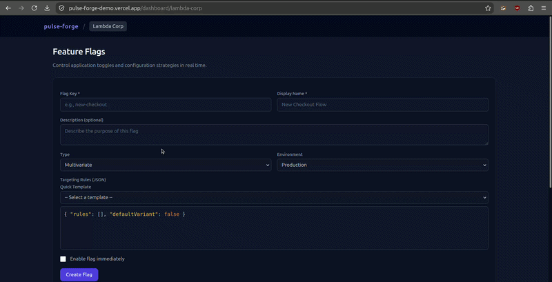
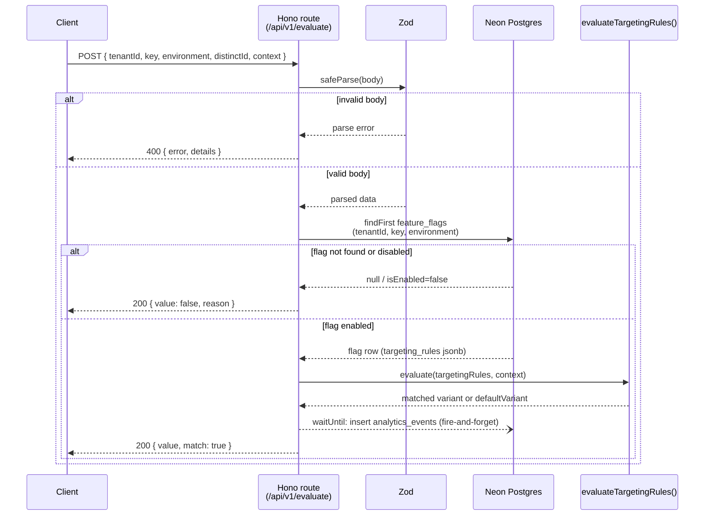

# pulse-forge

[](https://github.com/gulfaniputra/pulse-forge/actions/workflows/ci.yml)
[](<>)




[](https://pulse-forge-demo.vercel.app/)

**pulse-forge** is a multi-tenant feature-flag evaluation API and event-analytics ingestion service with a small dashboard for listing and creating flags per tenant/environment.

It's a Hono API colocated inside a Next.js App Router project, backed by Neon Postgres, targeting edge-native deployment via the `hono/vercel` adapter (`runtime = 'edge'`). It goes through a fully typed Hono RPC contract and flag creation runs through a separate Next.js Server Action, not the Hono API.

## Table of Contents

- [Features](#features)
- [Known Limitations](#known-limitations)
- [Architecture & Design Decisions](#architecture--design-decisions)
- [Tech Stack](#tech-stack)
- [API Reference](#api-reference)
  - [`GET /api/health`](#get-apihealth)
  - [`POST /api/v1/evaluate`](#post-apiv1evaluate)
  - [`GET /api/v1/flags`](#get-apiv1flags)
  - [`createFlag` Server Action](#createflag-server-action)
- [Request Flow](#request-flow)
- [Repository Structure](#repository-structure)
- [Environment Variables](#environment-variables)
- [Local Development Guide](#local-development-guide)
  - [Getting Started](#getting-started)
  - [Available Scripts](#available-scripts)
  - [Database Management (Drizzle Kit)](#database-management-drizzle-kit)
- [Git Workflow & CI/CD](#git-workflow--cicd)
- [Contributing](#contributing)
- [License](#license)

## Features

- **Multi-tenant schema:** `tenants`, `users`, `feature_flags`, `analytics_events` tables (Drizzle + Postgres) with `ON DELETE CASCADE` from tenant and a unique `(tenant_id, key, environment)` index so the same flag key can exist per environment per tenant.
- **Flag evaluation endpoint:** `POST /api/v1/evaluate` resolves a flag by tenant/key/environment and evaluates its `targeting_rules` JSONB in-memory, supporting both boolean and multivariate flags with a `defaultVariant` fallback.
- **Async analytics ingestion:** Every evaluation call writes an `analytics_events` row off the request's critical path via `executionCtx.waitUntil`.
- **Flag listing endpoint:** `GET /api/v1/flags` returns every flag for a `(tenantId, environment)` pair, 404s on an unknown tenant, ordered newest-updated-first.
- **Typed Hono RPC contract:** The API's `AppType` is exported and consumed directly by `createRpcClient`, so frontend/backend drift is caught at compile time rather than at runtime.
- **Tenant dashboard with flag creation:** `/dashboard/[tenantSlug]` server-renders the tenant's `production`-environment flags and now ships a client-side `CreateFlagForm`, backed by a `createFlag` Next.js Server Action.
- **Seed script:** `src/db/seed.ts` provisions one tenant, one user, a boolean flag, and a multivariate flag for local testing.

## Known Limitations

- **No auth on any route.** `/api/v1/evaluate`, `/api/v1/flags`, and `createFlag` check `tenantId` for UUID _shape_ only, not caller permission. Anyone who knows or guesses one can read and write that tenant's flags.
- **No Row-Level Security.** Tenant isolation is app-level only (explicit `WHERE tenantId = ...` in every Drizzle query), not a Postgres RLS policy. The spec allowed either RLS _or_ query-layer scoping, so this is compliant. But it's app-code discipline not a database-enforced guarantee.
- **No flag-editing or rule-authoring UI.** `createFlag` hardcodes `targetingRules` to `{ rules: [], defaultVariant: false }` (`CreateFlagForm` has no field for it); there's also no route to edit a flag once created.
- **The Neon serverless driver is untested in CI.** CI's `DATABASE_URL` is `localhost`, so it only exercises the local `pg` branch of `src/db/index.ts` — the `@neondatabase/serverless` `Pool` branch used in production has no CI coverage.

## Architecture & Design Decisions

- **Colocated monolith:** The Hono app is defined in `src/lib/hono-app.ts`. The Next.js catch-all route (`src/app/api/[[...route]]/route.ts`) just re-exports it through `hono/vercel`'s `handle()` for every HTTP verb, with `runtime = 'edge'`. One project, no cross-repo version drift.
- **End-to-end type safety (Hono RPC):** `src/lib/rpc.ts` instantiates `hc<AppType>()` against `hono-app.ts`'s exported type, so a schema/caller mismatch is a compile error. The dashboard page is one such caller. `client.api.v1.flags.$get(...)`, not a loose `fetch`.
- **Edge-optimized data modeling:** Targeting rules (conditions, rollout rules, variants) live as one `jsonb` column on `feature_flags`, so evaluation is one indexed row lookup plus in-memory matching (`src/lib/evaluator.ts`).
- **Dual database driver, chosen at runtime:** `src/db/index.ts` checks `NEXT_RUNTIME === 'edge'` and whether `DATABASE_URL` contains `localhost`/`127.0.0.1` — `pg` + `drizzle-orm/node-postgres` locally, or `@neondatabase/serverless`'s WebSocket `Pool` + `drizzle-orm/neon-serverless` (not the HTTP-only driver) everywhere else. Both non-local branches load via a runtime `require()`, which only resolves under the Vercel edge adapter's Node-compatible shim. A bare Cloudflare Workers runtime without `require` or global `WebSocket` would need this file rewritten.
- **Write path bypasses the Hono API:** `createFlag` (`src/app/actions/flags.ts`) is a Server Action calling Drizzle directly. No `hono-app.ts` route, no RPC-contract drift protection.

## Tech Stack

| Layer              | Technology                                  | Notes                                                                                                      |
| :----------------- | :------------------------------------------ | :--------------------------------------------------------------------------------------------------------- |
| **Frontend**       | Next.js 15.5.20 (App Router) + React 19.0.0 | Server Components render the dashboard. `CreateFlagForm` is the one `'use client'` island (Server Action). |
| **Styling**        | Tailwind CSS 3.4.16                         | Utility classes only.                                                                                      |
| **Backend**        | Hono 4.12.32 + Zod 3.24.0                   | Defined in `src/lib/hono-app.ts`, mounted at `/api` via `hono/vercel`.                                     |
| **Database & ORM** | PostgreSQL (Neon) + Drizzle 0.45.2          | `@neondatabase/serverless` (WebSocket `Pool`, `drizzle-orm/neon-serverless`) non-local. `pg` local.        |
| **Testing**        | Vitest 3.0.0 + Playwright 1.49.0            | Vitest hits a real Neon test branch. Playwright has one spec: `tests/e2e/health.spec.ts`.                  |
| **Tooling**        | ESLint 9 (flat config) + Prettier 3.9       | `eslint.config.mjs` shared with `next lint` rules.                                                         |

## API Reference

The Hono app is mounted at `/api`. These three routes are the only ones implemented — flag _creation_ is a separate mechanism, see [`createFlag` Server Action](#createflag-server-action).

### `GET /api/health`

Returns service liveness. No auth & no dependencies checked.

```json
{
  "status": "healthy",
  "timestamp": "2026-07-22T03:00:00.000Z"
}
```

### `POST /api/v1/evaluate`

Evaluates one flag for one tenant/environment/context and asynchronously logs the evaluation.

**Request body:**

```json
{
  "tenantId": "uuid, required",
  "key": "string, 1-100 chars, required",
  "environment": "string, 1-50 chars, required",
  "distinctId": "string, 1-255 chars, required",
  "context": { "optional": "arbitrary key/value pairs, defaults to {}" }
}
```

**Response — match found or default fallback (200):**

```json
{ "value": true, "match": true }
```

**Response — flag missing or disabled (200):**

```json
{ "value": false, "reason": "FLAG_NOT_FOUND" }
```

`reason` is `"FLAG_NOT_FOUND"` if no row matches `(tenantId, key, environment)`, or `"FLAG_DISABLED"` if the row exists but `is_enabled` is `false`.

**Response — invalid body (400):**

```json
{ "error": "Bad Request", "details": [/* Zod issue array */] }
```

> Refer [Known Limitations](#known-limitations). These routes check only `tenantId` shape.

### `GET /api/v1/flags`

Lists every flag for a `(tenantId, environment)` pair. Used by the dashboard page via the Hono RPC client.

**Query params:** `tenantId` (uuid, required), `environment` (string, 1-50 chars, required).

**Response — success (200):** an array of flags, newest-`updatedAt`-first:

```json
[
  {
    "id": "uuid",
    "key": "beta-dashboard",
    "name": "Beta Dashboard access",
    "description": "Enables the next-gen telemetry control panel.",
    "type": "boolean",
    "isEnabled": true,
    "environment": "production",
    "updatedAt": "2026-07-22T03:00:00.000Z"
  }
]
```

**Response: Tenant not found (404):** `{ "error": "Tenant not found" }`
**Response: Missing/invalid query params (400):** `{ "error": "Bad Request", "details": [/* Zod issue array */] }`

### `createFlag` Server Action

`src/app/actions/flags.ts` exports `createFlag`, a `'use server'` action bound to `CreateFlagForm` via `useActionState`. It calls Drizzle directly, validates with `createFlagSchema` (`src/lib/validations.ts`), and returns `{ success, errors }` for the form to render inline.

- Accepts `tenantId`, `key`, `name`, `description` (optional), `type` (`boolean` | `multivariate`, default `boolean`), `environment` (default `production`), `isEnabled` (default `false`).
- On a duplicate `(tenantId, key, environment)`, returns `{ success: false, errors: { _form: ['Flag with this key and environment already exists.'] } }` rather than throwing.
- Calls `revalidatePath('/dashboard/[slug]')` after a successful insert, skipped when `NODE_ENV === 'test'`. `targetingRules` is hardcoded to `{ rules: [], defaultVariant: false }` (refer [Known Limitations](#known-limitations)).

## Request Flow



## Repository Structure

```text
pulse-forge/
├── .github/workflows/
│   └── ci.yml                        # GitHub Actions pipeline
├── drizzle/
│   └── 0000_funny_drax.sql           # Initial schema migration
├── src/
│   ├── app/
│   │   ├── actions/
│   │   │   └── flags.ts              # 'use server' createFlag action
│   │   ├── api/[[...route]]/
│   │   │   └── route.ts              # hono/vercel adapter re-exporting hono-app.ts per HTTP verb
│   │   └── dashboard/[tenantSlug]/
│   │       ├── layout.tsx            # Resolves tenant by slug
│   │       └── page.tsx              # Fetches flags via Hono RPC
│   ├── components/
│   │   └── CreateFlagForm.tsx        # 'use client' form + useActionState + createFlag
│   ├── db/
│   │   ├── index.ts                  # Runtime-selected driver: pg (local) vs Neon serverless pool (non-local)
│   │   ├── schema.ts                 # Drizzle tables: tenants, users, feature_flags, analytics_events
│   │   ├── seed.ts                   # Local seed data
│   │   └── types.ts                  # TargetingRule/FeatureFlagTargeting shapes
│   └── lib/
│       ├── evaluator.ts              # In-memory targeting-rule evaluation
│       ├── hono-app.ts               # /health, /v1/evaluate, /v1/flags, exports AppType
│       ├── rpc.ts                    # Hono RPC client factory (createRpcClient) typed against hono-app.ts
│       └── validations.ts            # createFlagSchema (Zod) for the createFlag Server Action
├── tests/
│   ├── e2e/
│   │   └── health.spec.ts            # Playwright smoke test: GET /api/health
│   └── integration/
│       ├── evaluate.test.ts          # Vitest suite for POST /api/v1/evaluate against a real Neon test branch
│       ├── flags.test.ts             # Vitest suite for GET /api/v1/flags
│       └── flags-create.test.ts      # Vitest suite for the createFlag Server Action
├── .env.example                      # DATABASE_URL (pooled) + DATABASE_URL_UNPOOLED
├── .env.test.example                 # DATABASE_URL for the Neon test branch
├── drizzle.config.ts
├── eslint.config.mjs
├── playwright.config.ts              # testDir: tests/e2e
├── tsconfig.json
└── vite.config.ts                    # Vitest config
```

## Environment Variables

| Variable                | Used by                        | Required                  | Notes                                                                                                                                                                     |
| :---------------------- | :----------------------------- | :------------------------ | :------------------------------------------------------------------------------------------------------------------------------------------------------------------------ |
| `DATABASE_URL`          | `src/db/index.ts`, app runtime | Yes                       | Neon **pooled** connection string in production. A `localhost`/`127.0.0.1` string switches the app to the `pg` driver for local Postgres.                                 |
| `DATABASE_URL_UNPOOLED` | `drizzle.config.ts`            | For migrations            | Falls back to `DATABASE_URL` if unset. Drizzle Kit needs an unpooled connection.                                                                                          |
| `DATABASE_URL` (test)   | `tests/integration/*`          | For `test:integration`    | Set in `.env.test`, pointed at a **separate Neon test branch**. Integration tests write and delete real rows.                                                             |
| `NEXT_PUBLIC_APP_URL`   | `src/lib/rpc.ts`               | Recommended in production | Base URL for server-side Hono RPC calls. If unset in production, `createRpcClient` logs a console warning and falls back to `http://localhost:3000`, which will misroute. |

Copy `.env.example` to `.env.local` (and `.env.test.example` to `.env.test`) and fill in real Neon connection strings before running anything below.

## Local Development Guide

### Getting Started

Requires Node.js 20+ and npm 10+.

```bash
npm install --legacy-peer-deps
```

`--legacy-peer-deps` is needed because of peer-dependency mismatches between React 19 and some testing tooling.

Then set up your environment variables (see [Environment Variables](#environment-variables)) and push the schema:

```bash
npm run db:push
npm run db:seed
npm run dev
```

### Available Scripts

| Script                     | Purpose                                                                                         |
| :------------------------- | :---------------------------------------------------------------------------------------------- |
| `npm run dev`              | Start the local dev server.                                                                     |
| `npm run build`            | Production build.                                                                               |
| `npm run start`            | Run the production build locally.                                                               |
| `npm run lint`             | `eslint .`                                                                                      |
| `npm run format`           | `prettier --write .`                                                                            |
| `npm run typecheck`        | `tsc --noEmit`                                                                                  |
| `npm run check`            | `lint` + `typecheck` together.                                                                  |
| `npm run test:unit`        | `vitest` (watch mode).                                                                          |
| `npm run test:integration` | `NODE_ENV=test vitest run` (refer [Environment Variables](#environment-variables) for which DB) |
| `npm run test:e2e`         | `playwright test --project=chromium`. Run `tests/e2e/health.spec.ts` against a running server.  |

### Database Management (Drizzle Kit)

- `npm run db:generate`: Generate a SQL migration from `src/db/schema.ts`.
- `npm run db:migrate`: Apply generated migrations.
- `npm run db:push`: Push schema changes directly without a migration file (fast local iteration).
- `npm run db:studio`: Open Drizzle Studio against `DATABASE_URL`.
- `npm run db:seed`: Run `src/db/seed.ts`. The flag-list and flag-create paths are simpler and have no async fire-and-forget step.

## Git Workflow & CI/CD

`.github/workflows/ci.yml` runs a single `validate` job on every push and pull request targeting `main`:

```
[Checkout] -> [Setup Node 24] -> [npm ci --legacy-peer-deps] -> [Lint] -> [Typecheck]
  -> [Wait for DB (nc poll)] -> [db:migrate] -> [test:integration]
  -> [Playwright browser cache/install] -> [Build] -> [test:e2e]
```

## License

No license file is currently present in this repository. Treat it as all-rights-reserved until a `LICENSE` is added.
