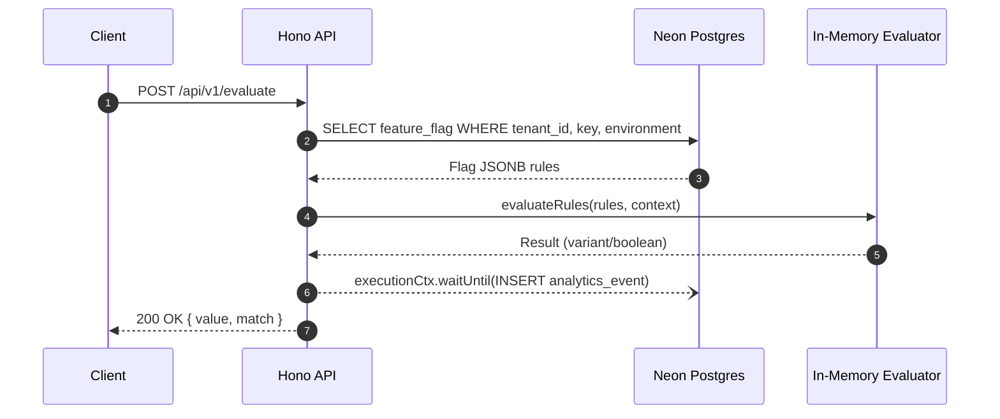

# pulse-forge

[](https://github.com/gulfaniputra/pulse-forge/actions/workflows/ci.yml)
[](https://www.gnu.org/licenses/gpl-3.0)


[](https://pulse-forge-demo.vercel.app/)

**pulse-forge** is a multi-tenant feature flag evaluation engine and event-analytics API with an embedded administrative dashboard.

Built as a Hono API on Vercel Edge Runtime inside Next.js App Router backed by Neon Serverless Postgres and Drizzle ORM.

## Table of Contents

- [Features](#features)
- [Architecture & Design Decisions](#architecture--design-decisions)
- [Tech Stack](#tech-stack)
- [API Reference](#api-reference)
- [Request Flow](#request-flow)
- [Repository Structure](#repository-structure)
- [Environment Variables](#environment-variables)
- [Local Development](#local-development)
- [License](#license)

## Features

- **Multi-Tenant Schema:** Isolated across `tenants`, `users`, `feature_flags`, and `analytics_events` via `(tenant_id, key, environment)` unique constraints.
- **Sub-Millisecond Evaluation:** In-memory rule resolution with deterministic `djb2` hashing for sticky percentage rollouts.
- **Non-Blocking Telemetry:** Async analytics ingestion off the request path using `executionCtx.waitUntil()`.
- **Typed Hono RPC Contract:** Exported `AppType` provides end-to-end type safety for client fetching.
- **Admin Workspace:** Server-rendered UI (`/dashboard/[tenantSlug]`) with PrismJS rule editor and Recharts analytics.
- **Server Action Mutations:** UI writes execute via Next.js Server Actions with immediate cache revalidation (`revalidatePath`).

## Architecture & Design Decisions

- **Colocated Edge API:** Mounted via catch-all handler (`src/app/api/[[...route]]/route.ts`) on Vercel Edge Runtime.
- **Dynamic Database Driver:** Toggles between Node native `pg` (CLI/tests) and `@neondatabase/serverless` WebSockets (Edge runtime) inside `src/db/index.ts`.
- **Known Limitations:** App-level tenant isolation (`WHERE tenant_id = ...`) instead of DB Row Level Security (RLS). Auth uses a single global `API_KEY` bearer secret.

## Tech Stack

| Layer                | Technology                                            |
| :------------------- | :---------------------------------------------------- |
| **Framework**        | Next.js 15 (App Router) + React 19                    |
| **API & Validation** | Hono 4 + Zod 3                                        |
| **Database & ORM**   | Neon Postgres + Drizzle ORM                           |
| **UI**               | Tailwind CSS 3.4 + PrismJS + Recharts                 |
| **Testing**          | Vitest 3 (Unit & Integration) + Playwright 1.49 (E2E) |

## API Reference

Protected REST routes require `Authorization: Bearer <API_KEY>`.

### `POST /api/v1/evaluate`

Evaluates flag rules against context and logs telemetry asynchronously.

```json
// Request body
{
  "tenantId": "e2b0281b-53c8-4a5e-b9e1-67822f30bd76",
  "key": "new-dashboard-v2",
  "environment": "production",
  "distinctId": "usr_99812",
  "context": { "role": "beta-tester" }
}

// Response 200 OK
{ "value": true, "match": true }

```

### Endpoints Overview

- `GET /api/health`: Public health check.
- `GET /api/v1/flags?tenantId=<UUID>&environment=<env>`: List tenant flags (Protected).
- `GET /api/v1/metrics?tenantId=<UUID>&environment=<env>`: 7-day evaluation metrics (Protected).
- **Server Actions (`src/app/actions/flags.ts`)**: `createFlag`, `updateFlag`, `deleteFlag`.

## Request Flow



## Repository Structure

```text
pulse-forge/
├── .github/workflows/ci.yml         # CI/CD pipeline
├── drizzle/                         # db migrations
├── src/
│   ├── app/
│   │   ├── actions/flags.ts         # Server Actions (CRUD)
│   │   ├── api/[[...route]]/        # Hono Edge route handler
│   │   └── dashboard/[tenantSlug]/  # Tenant dashboard pages
│   ├── components/                  # UI components & charts
│   ├── db/                          # Schema, dynamic client & seeder
│   └── lib/
│       ├── evaluator.ts             # Evaluation engine
│       ├── hono-app.ts              # Hono API definition
│       └── validations.ts           # Shared Zod schemas
└── tests/                           # Integration & E2E suites

```

## Environment Variables

| Variable                | Scope           | Description                                      |
| ----------------------- | --------------- | ------------------------------------------------ |
| `DATABASE_URL`          | Runtime         | Neon pooled connection string (`postgres://...`) |
| `DATABASE_URL_UNPOOLED` | Migrations      | Direct database connection for Drizzle Kit       |
| `API_KEY`               | Auth Middleware | Bearer token secret for `/api/v1/*` routes       |

## Local Development

```bash
# Setup
npm install --legacy-peer-deps
cp .env.local.example .env.local

# Database & Server
npm run db:push && npm run db:seed
npm run dev

# Verifications
npm run check              # Lint & Typecheck
npm run test:integration   # Vitest integration tests
npm run test:e2e           # Playwright E2E tests

```

## License

[GNU GPL v3.0](LICENSE)
